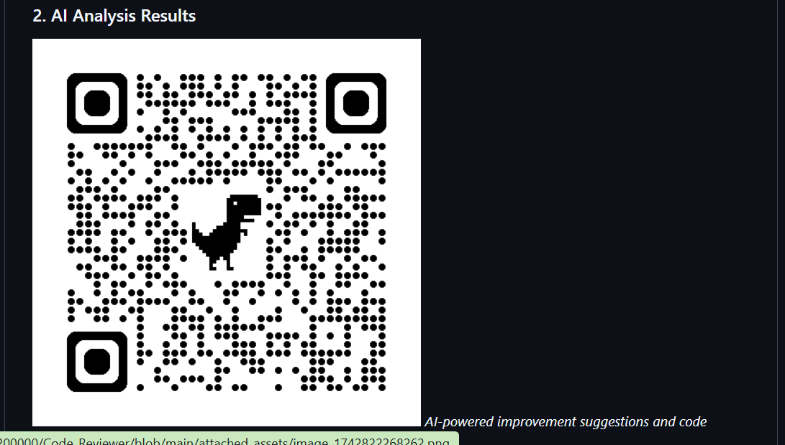

# AI-Powered Code Reviewer for GitLab

An advanced AI-powered code review tool that integrates with GitLab to provide automated code analysis, suggestions, and quality metrics.


## 📸 Screenshots


*Main code review interface with instant code analysis*


*Submit your code with language selection and review options*


*Transform your code quality with AI-powered analysis*


## 🚀 Features

- **AI-Powered Analysis**: Intelligent code review using advanced AI models
- **GitLab Integration**: Seamless integration with GitLab merge requests
- **Multi-Language Support**: Supports multiple programming languages
- **Quality Metrics**: Detailed code quality and complexity analysis
- **Security Scanning**: Identifies potential security vulnerabilities
- **Interactive Reports**: Generate detailed PDF and text reports

## 🛠️ Tech Stack

- **Frontend**: React + TypeScript + Vite
- **Backend**: Node.js + Express
- **AI Integration**: Hugging Face API
- **Database**: PostgreSQL with Drizzle ORM
- **UI Components**: Tailwind CSS + shadcn/ui

## 💻 Local Development Setup

1. Clone the repository:
   ```bash
   git clone https://github.com/yourusername/ai-powered-code-reviewer.git
   cd ai-powered-code-reviewer
   ```

2. Install dependencies:
   ```bash
   npm install
   ```

3. Set up environment variables:
   Create a `.env` file with:
   ```
   HUGGINGFACE_API_KEY=your_huggingface_api_key
   GITLAB_API_TOKEN=your_gitlab_token
   DATABASE_URL=your_database_url
   ```

4. Start the development server:
   ```bash
   npm run dev
   ```

The application will be available at `http://localhost:5000`

## 🔄 DevOps Implementation

### CI/CD Pipeline

We use GitLab CI/CD for automated testing and deployment. Here's the pipeline structure:

1. **Build Stage**
   - Lint code
   - Run unit tests
   - Build frontend assets

2. **Test Stage**
   - Run integration tests
   - Run security scans
   - Check code coverage

3. **Deploy Stage**
   - Deploy to staging
   - Run smoke tests
   - Deploy to production

### Deployment

The application can be deployed on Replit:

1. Import the repository to Replit
2. Configure environment variables in Replit Secrets
3. Use the Deploy button to publish your changes

### Monitoring

- Application logs through Replit's console
- Performance metrics via built-in analytics
- Error tracking and reporting

## 🏗️ Project Structure

```
├── client/           # Frontend React application
│   ├── src/
│   │   ├── components/  # UI components
│   │   ├── hooks/      # Custom React hooks
│   │   ├── lib/        # Utility functions
│   │   └── pages/      # Page components
├── server/           # Backend Express server
│   ├── ai.ts        # AI integration
│   ├── gitlab.ts    # GitLab API integration
│   └── routes.ts    # API routes
└── shared/          # Shared types and schemas
```

## 🤝 Contributing

1. Fork the repository
2. Create a feature branch
3. Make your changes
4. Submit a pull request

## 📋 API Documentation

### Code Review Endpoint
```
POST /api/review
Body: {
  "language": "python",
  "code": "...",
  "gitlabProjectId": 123,
  "gitlabMergeRequestId": 456
}
```

### GitLab Integration
```
POST /api/gitlab/connect
Body: {
  "token": "your_gitlab_token"
}
```

## 📄 License

MIT License - See LICENSE file for details

## 🔐 Security

- All API keys are stored securely
- GitLab tokens are encrypted
- Regular security audits
- Automated vulnerability scanning

## 📞 Support

For support, please open an issue in the GitHub repository.

---

© 2024 AI-Powered Code Reviewer. All rights reserved.